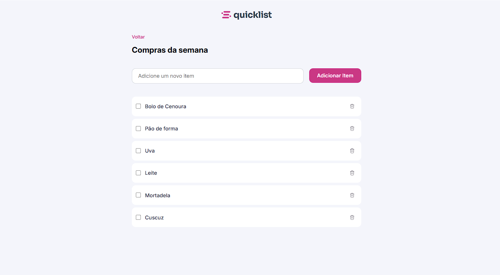
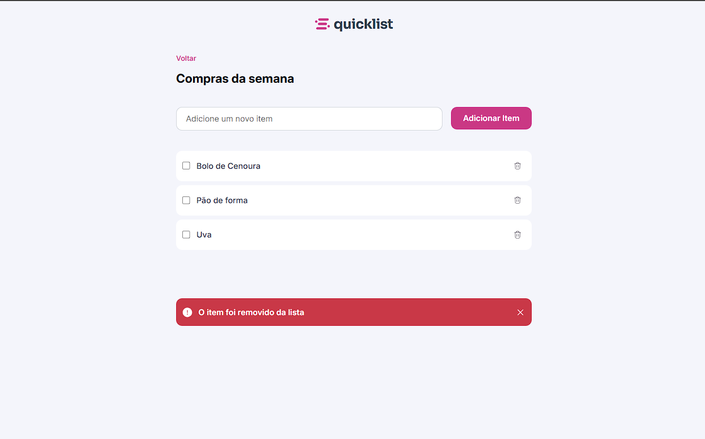

# QuickList - Lista de Compras

 

QuickList é um aplicativo web simples para gerenciar listas de compras. Com ele, você pode adicionar itens, marcá-los como concluídos e removê-los facilmente.

## 📌 Funcionalidades
- Adicionar novos itens à lista.
- Marcar itens como concluídos.
- Remover itens da lista.
- Exibir uma mensagem de alerta ao excluir um item.

## 🛠 Tecnologias Utilizadas
- HTML5
- CSS3
- JavaScript
- Google Fonts (Inter, Sora)

## 🚀 Como Executar o Projeto

### 1️⃣ Clonar o Repositório
```bash
git clone https://github.com/caiosantosxp/quicklist.git
```

### 2️⃣ Acessar o Diretório do Projeto
```bash
cd quicklist
```

### 3️⃣ Abrir o Arquivo `index.html`
Abra o arquivo `index.html` diretamente no navegador ou utilize a extensão **Live Server** no VS Code para uma melhor experiência.

## 📂 Estrutura do Projeto
```
quicklist/
│-- assets/       # Imagens e ícones
│-- scripts/      # Código JavaScript
│-- styles/       # Arquivos CSS
│-- index.html    # Página principal
│-- README.md     # Documentação do projeto
```
## 📄 Licença
Este projeto está sob a licença MIT da Rocketseat. 🚀

